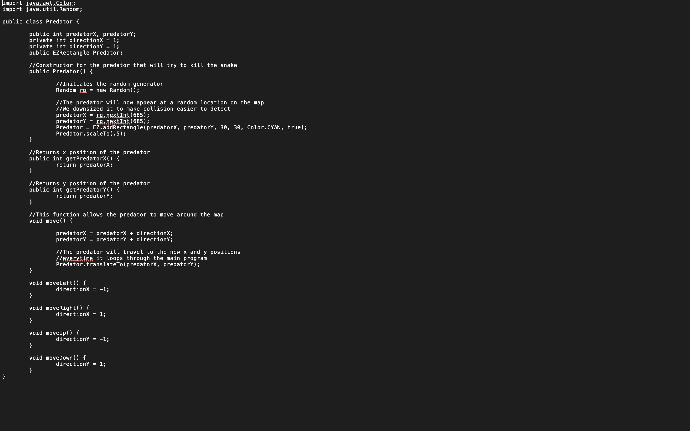

This was the final project for ics 111 at UH Manoa. For this project we got to pick people to work on a game that would run. For this we picked a simple snake game to show off what we have learned in ics 111. This wasn’t a very hard thing to do since we had EZjava which was given to us that had functions that made coding this project much easier. So our group got started. As shown in the screenshots we just checked what the user had clicked and made the snake go into that direction. This project was one of the first projects that I had to work on as a team in coding. This was a great experience for me because it helped me learn what collaborating on code was gonna be like and had a great time working with some great people.

